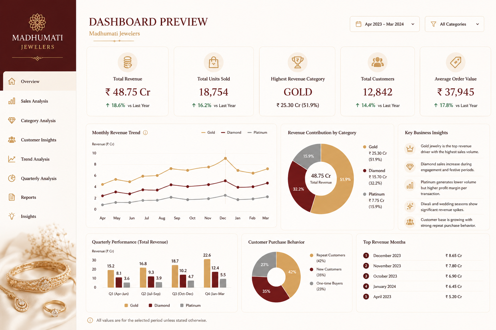
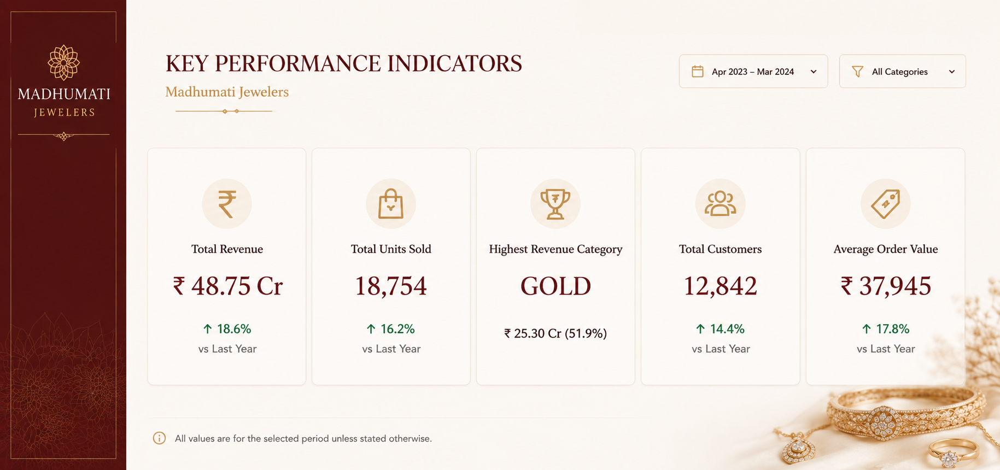

***Sales Performance & Market Trend Analysis | Madhumati Jewelers*** 

---
***Introduction*** 

This project presents a detailed sales and market trend analysis for Madhumati Jewelers over the period of April 2023 to March 2024. The report was designed to evaluate the performance of the brand across its three main product categories: Gold, Diamond, and Platinum jewelry. The objective of this analysis is to understand how each category contributed to overall revenue, how customer purchasing patterns changed over time, and how seasonal demand affected sales performance. Since jewelry sales are strongly influenced by festivals, weddings, and special occasions, this study focuses on identifying those patterns and turning them into useful business insights. The dashboard is created in a premium visual style to reflect the luxury nature of the brand while also presenting business data in a clear and structured way.

---
***Business Objective***

The main objective of this project is to analyze and compare the category-wise sales performance of Gold, Diamond, and Platinum jewelry over a one-year period. The report is designed to identify which category generates the highest revenue, how customer demand changes during different seasons, and which business opportunities can help improve future growth.

This analysis also helps in understanding:

* Revenue contribution of each jewelry category
* Monthly and quarterly sales growth trends
* Seasonal demand during wedding and festive periods
* Customer purchasing preferences
* Customer segmentation and buying behavior
* Future growth opportunities and forecasting
* Overall business performance and profitability

---
***Dataset Overview***

The dataset used in this project contains one year of transactional sales records for Madhumati Jewelers. The dataset includes business metrics such as:

* Monthly sales revenue
* Units sold
* Customer count
* Average order value
* Category-wise performance
* Quarterly revenue trends
* Seasonal demand patterns

The data is divided into three major product segments:

* Gold Jewelry 
* Diamond Jewelry
* Platinum Jewelry

The dataset was cleaned, organized, and analyzed to identify revenue trends, customer behavior, and category performance. It was then used to create interactive dashboards and business visuals for reporting and presentation purposes.

---
***Tools and Technologies Used***

This project was developed using the following tools:

* Microsoft Excel for data cleaning, calculation, and analysis
* Figma for dashboard layout design and visual presentation planning
* Charts and graphs for trend analysis, comparison, and insight generation

These tools were used together to create a professional and visually consistent business report.

---
***Key Performance Indicators (KPIs)***

The dashboard uses the following KPIs to summarize overall business performance:

* Total Annual Revenue
* Total Units Sold
* Highest Revenue Generating Category
* Total Customers
* Average Order Value
* Monthly Sales Growth Rate
* Quarterly Performance Comparison
* Seasonal Demand Trends

These KPIs provide a quick overview of how the business performed during the selected period.

---
***Dashboard Structure***

`1. Front Page`

This page introduces the project and sets the visual tone for the entire dashboard. It presents the brand identity of Madhumati Jewelers in a luxury-style layout and clearly communicates that the project is focused on sales performance and market trend analysis. The cover page is designed to look premium, elegant, and brand-consistent. It gives the viewer a first impression of the report’s purpose and visual style.

---
`2. Dashboard Overview`

This page gives a high-level summary of the full dashboard. It includes key KPIs, monthly trend analysis, category contribution, customer behavior, and top revenue months. It acts as the main reporting page where the most important business numbers are displayed together in one view. This page is useful for quickly understanding the overall performance of the business and identifying the strongest revenue drivers.

----
`3. Key Performance Indicators`

This page highlights the most important business metrics in a clean and structured layout. It includes total revenue, total units sold, highest revenue category, total customers, and average order value.
The KPI page helps in understanding the overall scale of the business and gives a quick summary of performance before moving into deeper analysis.

---
`4. Sales Trend and Category Analysis`

This page focuses on monthly sales trends and category-wise revenue contribution. The line chart shows how revenue changed throughout the year for Gold, Diamond, and Platinum, while the donut chart shows the percentage contribution of each category to total revenue. This page also includes key business insights, customer purchase behavior, and top revenue months. It helps explain when sales were strongest and which categories were driving performance.

 

---
`5. Category Wise Performance Analysis`

This page presents a quarterly comparison of revenue across the three jewelry categories. It helps identify how each category performed in different quarters and highlights the seasonal impact on sales. The quarterly chart makes it easier to compare Gold, Diamond, and Platinum across the year and understand how performance changed over time.

  

---
`6. Customer Segmentation Analysis`

This page focuses on understanding the different types of customers who buy from Madhumati Jewelers. The customer segmentation analysis shows that the business serves a mix of repeat customers, new customers, premium customers, and one-time buyers. Repeat customers form an important part of the business because they contribute to long-term growth and show strong brand loyalty. New customers help expand the customer base, especially during festive and wedding seasons. Premium customers are especially valuable because they generate a larger share of revenue and usually have a higher average order value.

The segmentation analysis also shows that customer age and buying behavior influence purchase patterns. Middle-age customers contribute strongly to purchases, while seasonal and wedding shoppers play an important role in driving demand. This page helps explain who the customers are, how they buy, and which segments are most important for future growth.

---
`7. Revenue Forecast and Growth Opportunities` 

This page looks beyond past performance and focuses on future growth. The revenue forecast chart shows the expected direction of sales based on the existing trend pattern. The forecast suggests continued growth if current business conditions remain stable and seasonal demand continues to support sales.The seasonal demand heatmap highlights that revenue is strongest during festive and wedding periods. These months create the highest demand across all categories, especially Gold and Diamond. The analysis also shows that demand is lower during off-season months, which makes planning and forecasting more important for the business.

This page also identifies possible growth opportunities. These include improving platinum visibility, strengthening customer loyalty programs, increasing premium diamond sales, and using targeted campaigns during high-demand months. It also highlights the key business risks, such as heavy dependence on Gold and seasonal revenue concentration.The recommendations in this section are designed to help Madhumati Jewelers improve future growth, balance category performance, and increase profitability.

`8. Business Insights and Conclusion`

This page summarizes the major findings from the analysis. It explains what the data means from a business perspective and provides a conclusion based on the overall performance of Madhumati Jewelers. This section is important because it turns raw data into business understanding and connects the dashboard results to decision-making.

---
***Business Performance Summary***

The overall analysis shows that Madhumati Jewelers achieved strong business growth throughout the year. Revenue, units sold, and customer count all showed positive performance compared to the previous year. The brand’s performance was supported by consistent demand for Gold jewelry, growing interest in Diamond jewelry, and steady premium sales from Platinum jewelry. 

The results also show that sales were strongly influenced by seasonal events such as Diwali, wedding periods, and festive months. These periods created revenue spikes across all major categories, especially Gold and Diamond. The dashboard is designed to show both the overall business performance and the deeper category-wise and customer-wise patterns behind the numbers.

---
***Sales Trend Analysis***

The sales trend analysis shows that revenue increased steadily over the year, with visible spikes during festive and wedding periods. Gold jewelry remained the most stable and dominant category, contributing the largest share of annual revenue. Diamond jewelry showed strong performance during premium purchase occasions such as engagements and celebrations, while Platinum jewelry remained a smaller but valuable segment with higher-value transactions.

Monthly trends revealed that the highest revenue months occurred during the festive season and at the end of the calendar year. This confirms that jewelry sales at Madhumati Jewelers are closely linked to traditional buying behavior, seasonal celebrations, and special family occasions. The trend page helps in understanding how sales moved month by month and which product categories were responsible for the changes in performance.

---
***Category-Wise Performance Analysis***

The category-wise analysis compares the performance of Gold, Diamond, and Platinum jewelry across the year. 

* Gold jewelry emerged as the top-performing category and generated the highest overall revenue share. It remained strong across most months because of its wide customer appeal and strong seasonal demand.

* Diamond jewelry contributed a significant share of premium revenue and performed especially well during special occasions. It showed stronger performance during celebration-driven purchases and higher-end gifting periods.

* Platinum jewelry had lower sales volume compared to the other two categories, but it contributed to the premium segment of the business.

Even though the category sold less frequently, it supported the brand’s luxury positioning and added value through higher-margin transactions. This analysis shows that each category plays a different role in the business. Gold drives volume, Diamond supports premium growth, and Platinum contributes niche high-value sales.

---
***Key Business Insights***

The dashboard analysis generated several important business insights:

* Gold is the primary revenue driver and contributes the largest share of total sales.
* Diamond jewelry performs strongly during festive, celebratory, and premium purchase periods.
* Platinum jewelry attracts niche luxury customers and adds value through premium transactions.
* Revenue increases significantly during festive and wedding seasons.
* Repeat customers play an important role in supporting long-term business growth.
* Customer behavior changes across categories, seasons, and purchasing occasions.
* Future growth can be improved through targeted marketing, customer retention, and category diversification.

These insights provide a clear understanding of how the business performs and where future improvement is possible.

---
***Conclusion***

This Sales Performance & Market Trend Analysis provides a complete view of Madhumati Jewelers’ yearly business performance. By analyzing sales trends, category-wise revenue, customer segmentation, and future growth opportunities, the dashboard helps explain both the current performance and the strategic direction of the business. The project shows that Gold jewelry remains the strongest category, while Diamond and Platinum support premium sales and brand value. The analysis also confirms that seasonal events and festive periods have a major influence on customer demand and overall revenue.

In addition to reporting historical performance, this dashboard also provides forward-looking insights through forecasting, segmentation, and growth planning. The project demonstrates how data analysis can support smarter business decisions, better inventory management, improved marketing planning, and stronger customer engagement. Overall, this project presents a professional and visually polished example of business analytics for a luxury retail brand. It combines data analysis, dashboard design, and strategic thinking into one structured reporting solution.

---
***Sources & References***

* Dashboard inspiration and layout references from: Pinterest, Behance, Dribbble

* Jewelry and luxury brand visual inspiration inspired by premium jewelry brands like Kantilal Chotalal Jewelry and modern business reporting dashboards.

* Product and background images sourced from royalty-free references and edited for dashboard presentation purposes.

* Dashboard developed using: Microsoft Excel

* Data used in this project is sample business data created for educational and portfolio purposes.

---
***Final Note***

This project was built as a business analytics and dashboard design case study for Madhumati Jewelers. It demonstrates the use of data visualization, customer analysis, category analysis, and forecast-based planning to support business decision-making. 

This project is a fictional portfolio case study created for educational, analytical, and presentation purposes only. Any resemblance to real businesses or datasets is purely coincidental. 

---
***Project Type***

Business Analytics Dashboard, Sales Analysis, Market Trend Analysis, Customer Segmentation, Revenue Forecasting, Data Visualization

---
***Author***

Dhruv Agarwal, Business Analytics & Dashboard Design Project

